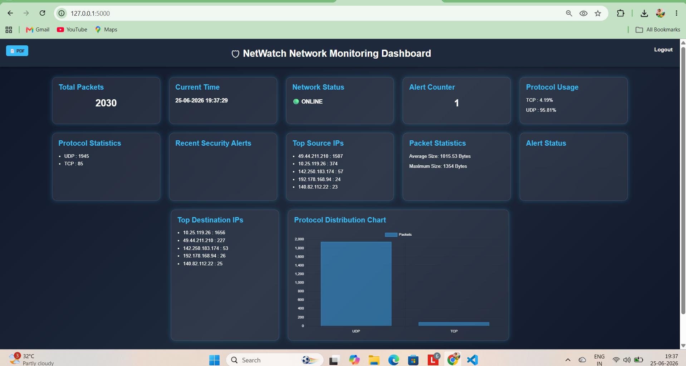
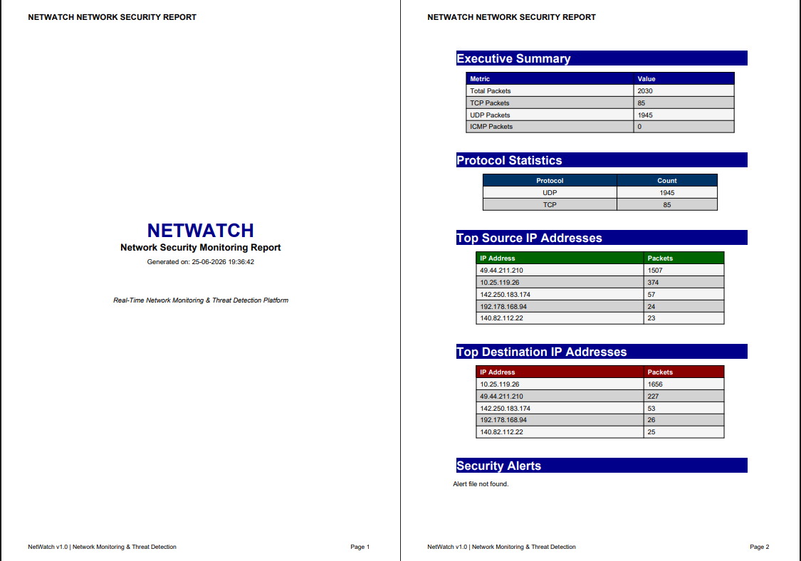

# 🛡️ NetWatch - Real-Time Network Monitoring & Threat Detection Platform

## 📌 Overview

NetWatch is a Python-based network monitoring and threat detection platform that captures live network traffic, analyzes protocols, detects suspicious activities, and visualizes network statistics through a modern web dashboard.

The project is designed to help Network Engineers, NOC Engineers, and Security Analysts monitor network traffic in real time and generate security reports.

---

## 🚀 Features

### 📡 Network Traffic Monitoring

* Live packet capture using Scapy
* Real-time network traffic analysis
* Source and destination IP tracking
* Protocol identification (TCP, UDP, etc.)

### 📊 Interactive Dashboard

* Built with Flask
* Real-time statistics updates
* Protocol usage visualization
* Network status monitoring
* Security alert display
* Top source IP analysis
* Top destination IP analysis
* Packet size statistics

### 🔐 Authentication

* Secure login system
* Session management
* Logout functionality

### 🚨 Threat Detection

* High traffic detection
* Port scan detection
* Security alert logging
* Alert dashboard integration

### 📄 PDF Reporting

* Automated report generation
* Protocol statistics
* Source IP analysis
* Destination IP analysis
* Security alert summary
* Downloadable PDF reports

---

## 🛠️ Technologies Used

| Technology | Purpose            |
| ---------- | ------------------ |
| Python     | Core Development   |
| Flask      | Web Dashboard      |
| Scapy      | Packet Sniffing    |
| Pandas     | Data Analysis      |
| Chart.js   | Data Visualization |
| ReportLab  | PDF Generation     |
| HTML/CSS   | Frontend Design    |

---

## ▶️ Running the Project

### Step 1: Start Packet Sniffer

```bash
python packet_sniffer.py
```

### Step 2: Launch Dashboard

```bash
python dashboard.py
```

### Step 3: Open Browser

```text
http://127.0.0.1:5000
```

---

## 🔑 Login Credentials

```text
Username: admin
Password: netwatch123
```

---

## 📊 Dashboard Features

* Total Packets Captured
* Current Time
* Network Status
* Alert Counter
* Protocol Usage
* Protocol Statistics
* Top Source IPs
* Top Destination IPs
* Packet Statistics
* Security Alerts
* PDF Report Download

---

## 📄 PDF Report

The generated report contains:

* Traffic Summary
* Protocol Statistics
* Top Source IPs
* Top Destination IPs
* Security Alerts
* Network Monitoring Summary

---

## 🚨 Threat Detection Logic

### High Traffic Detection

Triggers alerts when packet volume exceeds defined thresholds.

### Port Scan Detection

Detects suspicious activity when a source IP attempts connections to multiple destination ports within a short period.

### DDoS Detection (Future Enhancement)

Monitors excessive traffic from a single source IP.

---

## 📸 Screenshots

### Dashboard



### PDF Report



## 👨‍💻 Author

Santhosh S

B.E. Electronics and Communication Engineering

Velammal Engineering College

---

## ⭐ Project Highlights

* Real-Time Network Monitoring
* Threat Detection Platform
* Professional Dashboard
* Authentication System
* Automated PDF Reporting
* Resume-Ready Networking Project

